# Job Search: resume-matched jobs from LinkedIn, Naukri and Indeed

Upload your resume and get the **latest jobs that fit you**, ranked by an AI match score, with
**matching and missing skills** for every job. It runs **on your own computer**: a local web page
drives a real browser (Playwright) through LinkedIn, Naukri and Indeed, and OpenAI reads your resume
and scores each job.

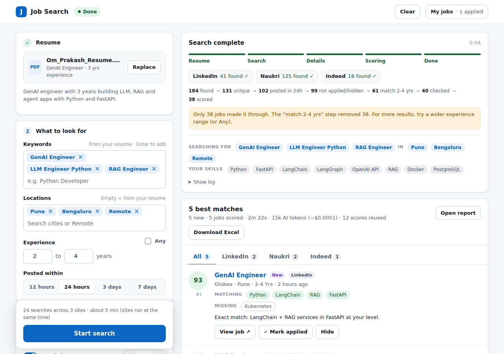

> Screenshots in this guide use sample data.

**What it does for you**

- Reads your resume and fills in keywords, city and an experience range automatically
- Searches LinkedIn, Naukri and Indeed **at the same time**, only recent posts (12 h to 7 days)
- Scores every job 0-100 against your resume and explains why (matching / missing skills)
- Remembers jobs you **applied to** or **hid**, and can show **only new** jobs
- Runs **every day at a time you choose**, even when the page is closed
- Keeps your page as it was after a reload or restart, until you press **Clear**
- Saves work it already did (job details, AI scores, resume reading), so repeat runs are faster and cheaper

---

## Contents

1. [Install (one time)](#1-install-one-time)
2. [Start the app](#2-start-the-app)
3. [How to use the website, step by step](#3-how-to-use-the-website-step-by-step)
4. [Tips and troubleshooting](#4-tips-and-troubleshooting)
5. [Settings in `.env`](#5-settings-in-env)
6. [Command line (optional)](#6-command-line-optional)
7. [Where your data is stored](#7-where-your-data-is-stored)
8. [For developers](#8-for-developers)

---

## 1. Install (one time)

You need **Python 3.10+**, **Git** and an **OpenAI API key**.

```bash
git clone https://github.com/pattjoshi/playwright-python-job-search.git
cd playwright-python-job-search

python -m venv .venv
# Windows:      .venv\Scripts\activate
# macOS/Linux:  source .venv/bin/activate

pip install -r requirements.txt
playwright install chromium

# Windows: copy .env.example .env      macOS/Linux: cp .env.example .env
```

Open `.env` in a text editor and paste your key:

```ini
OPENAI_API_KEY=sk-...
```

`.env` is never uploaded to GitHub, so your key stays on your computer.

## 2. Start the app

```bash
python -m job_search.web
```

On Windows you can also just **double-click `start_ui.bat`**.

Your browser opens **http://127.0.0.1:8000**. Keep the terminal window open while you use the page;
press **Ctrl+C** in it to stop the app. The page only works on your computer (it isn't on the internet).

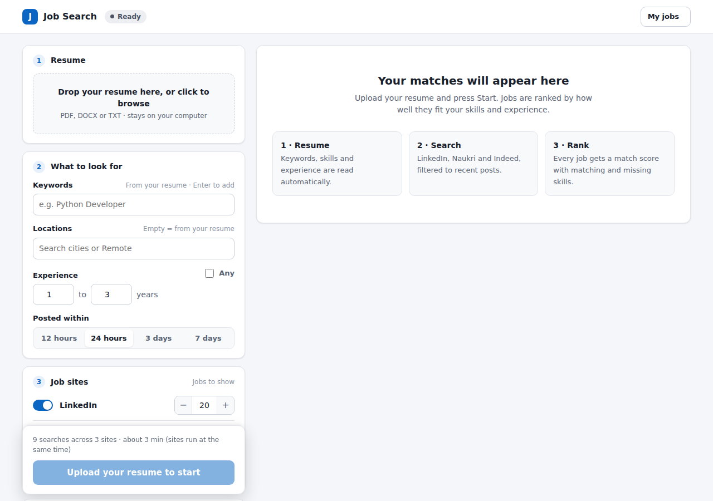

---

## 3. How to use the website, step by step

The **left side** is where you set up the search; the **right side** shows progress and results.

### Step 1 · Upload your resume

1. **Drag your resume** onto the box, or click it and choose the file (**PDF, DOCX or TXT**).
2. Wait a few seconds while the AI reads it.
3. The card shows your file name, current title, years of experience and a one-line summary.

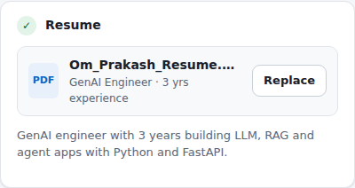

- **Same resume again?** The AI reading is reused: no extra AI cost.
- **After a reload or app restart** the resume is still there (a green note says it was restored).
  You don't need to upload it again.
- To use a different resume, click **Replace**.

### Step 2 · What to look for

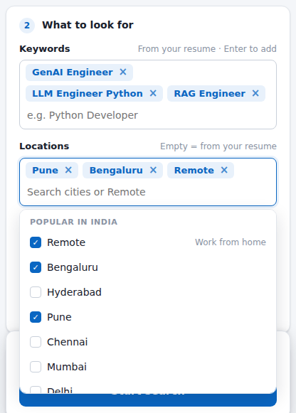

1. **Keywords**: filled in from your resume. Type a new one and press **Enter** to add it; click **×** to
   remove one. Fewer keywords = faster search.
2. **Locations**: click the box and pick one or more cities, or **Remote** (work from home).
   Type to filter (e.g. `hyd` + **Enter** picks Hyderabad). You can also type any other city and choose
   **Add "…"**. Leave it empty to use the city from your resume.
3. **Experience**: e.g. **2 to 4** years. Jobs asking for clearly more or less are filtered out.
   Tick **Any** to switch this off.
4. **Posted within**: **12 hours**, **24 hours**, **3 days** or **7 days**.

### Step 3 · Job sites and how many jobs to show

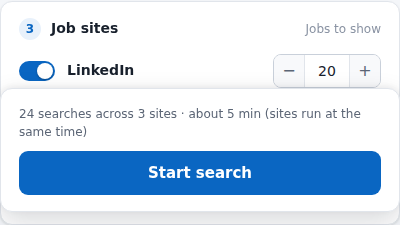

- Turn each site **on or off** with its switch.
- Use **− / +** (or type) to choose **how many jobs to show from that site** (1-100),
  e.g. LinkedIn 20, Naukri 12, Indeed 10.

### Step 4 · Options

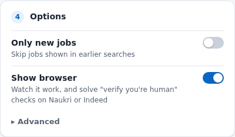

- **Only new jobs**: skip jobs you were already shown in earlier searches.
- **Show browser**: watch the search happen. Keep this **on** if Naukri or Indeed ask you to
  "verify you're human": you can solve it in the browser window and the search continues.
- **Advanced**:
  - *Pages per search*: how deep to look on each site (default 3).
  - *Jobs to score per site*: how many jobs the AI checks per site (default 40). Higher = slower and a bit more cost.
  - *Forget seen jobs*: makes previously shown jobs count as new again (applied/hidden jobs stay).

### Step 5 · Start, watch, stop

1. Check the estimate above the button (e.g. *"24 searches across 3 sites · about 5 min"*).
2. Click **Start search**.
3. Watch the progress card: the steps (**Resume → Search → Details → Scoring → Done**), each site's
   status and how many jobs it found, and a timer.
4. Click **Stop search** at any time to cancel.

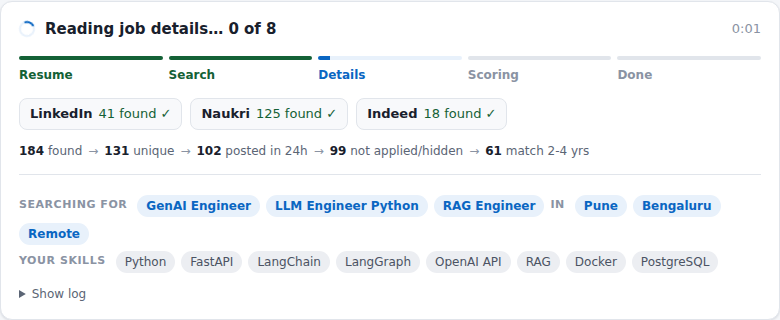

The line of numbers is the **funnel**: how many jobs were left after each filter, e.g.
`184 found → 131 unique → 102 posted in 24h → 61 match 2-4 yrs → 38 scored`. If you get fewer jobs than
you asked for, a yellow hint tells you which filter removed the most and what to change.

### Step 6 · Read the results

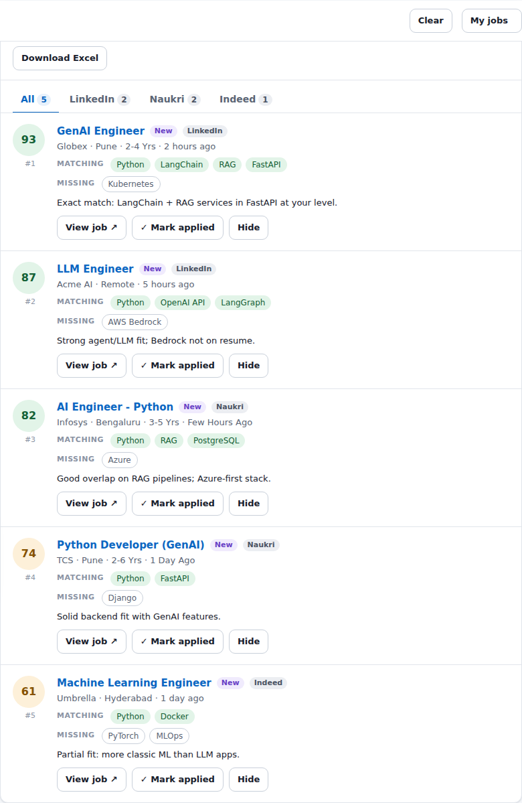

- The header shows how many jobs are new, the run time, AI tokens used (and cost, if configured) and how
  many scores were reused from earlier runs.
- **Tabs**: **All** (best matches from every site) or one site at a time.
- Each job card shows:
  - the **match score** (green 75+, yellow 50-74, grey below 50)
  - title, company, location, required experience, when it was posted
  - a **New** badge if you haven't seen it before
  - **Matching** skills (green) and **Missing** skills
  - a one-line reason for the score
- Buttons on each job:
  - **View job ↗**: opens the job on the site, where you apply
  - **✓ Mark applied**: tracks it in *My jobs* and never shows it again
  - **Hide**: never show this job again (**Undo** is right there)
- **Open report** opens the same results as a standalone HTML page; **Download Excel** gets every scored job.

### Step 7 · My jobs and search history

Click **My jobs** (top right).

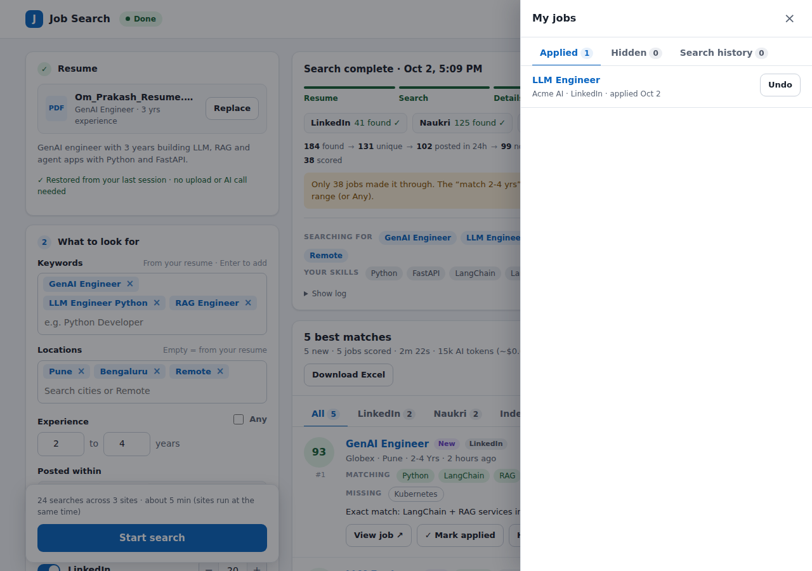

- **Applied** and **Hidden** tabs list those jobs with links and dates. **Undo** moves a job back.
- **Search history** lists every search (manual and daily): status, time taken, jobs found per site,
  how many were shown/new, tokens and cost, the funnel, any error, and a link to its report.

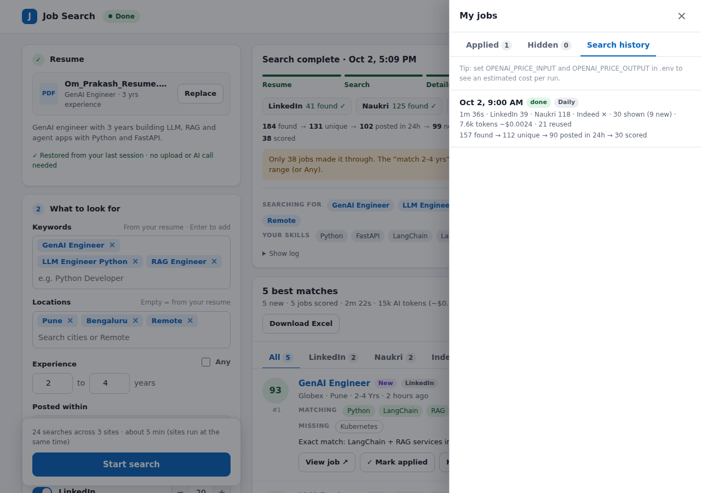

### Step 8 · Daily search (automatic)

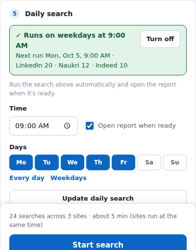

1. Set up the search above the way you like it (resume, keywords, cities, sites…).
2. In **Daily search**, choose a **time** (e.g. 9:00 AM) and the **days** (or click **Every day** / **Weekdays**).
3. Click **Save daily search**.

- It runs through **Windows Task Scheduler** (cron on macOS/Linux), so it works **even when the page is
  closed**. If the laptop was off or asleep at that time (Windows), it runs as soon as it's back on.
- When it finishes, the report opens in your browser (untick *Open report when ready* if you don't want that).
- The card shows the next run, the last run with a link to its report, and a **Turn off** button.
- Changed your settings? Click **Update daily search**.
- Test it without waiting: `python -m job_search.daily` (log: `data/scheduled.log`).

### Step 9 · Reload, restart and Clear

- **Reloading the page or restarting the app keeps everything**: your resume, keywords, the last search's
  progress and results (including jobs you marked applied).
- Click **Clear** (top right) to remove the **resume, keywords and results** from the page.
  It asks you to confirm first. **Your settings, applied/hidden jobs, search history and daily search are kept.**

---

## 4. Tips and troubleshooting

| What you see | What to do |
|---|---|
| **0 jobs** from a site | Check the funnel line and the yellow hint. Try more cities, fewer filters, *Any* experience or a longer *Posted within*. Click **Show log** for details. |
| **"verify you're human"** on Naukri or Indeed | Keep **Show browser** on and solve it in the browser window; the search continues. |
| A site shows **couldn't load ✕** | The site was down or blocking for now; the other sites still ran. Try again later. |
| **"OPENAI_API_KEY is not set"** | Put your key in `.env` and restart the app. |
| **"Could not read your resume"** | Use a text-based PDF or DOCX (not a scanned image). |
| **"Upload your resume first"** | Your saved resume file was cleaned up or cleared; upload it again. |
| Searches are slow | Fewer keywords or cities, fewer *Pages per search*, or a lower *Jobs to score per site*. Repeat runs are faster because work is reused. |
| Too many browser windows | That's one per site while searching in parallel. Set `PARALLEL_SITES=false` in `.env` to use one at a time. |
| Want to see the cost in $ | Add your model's prices to `.env` (`OPENAI_PRICE_INPUT`, `OPENAI_PRICE_OUTPUT`). |

**Be polite to the job sites.** The tool waits between requests, retries when a site says "too many requests",
and gives up on a site that keeps failing. Job boards restrict automated access, so keep this for
personal, low-volume use.

## 5. Settings in `.env`

The web page remembers your choices on its own. These `.env` settings are defaults (and are used by the
command line). See `.env.example` for the full list with comments.

| Setting | Default | Meaning |
|---|---|---|
| `OPENAI_API_KEY` | (required) | Your OpenAI key |
| `OPENAI_MODEL` | `gpt-5.4-mini` | Model used to read resumes and score jobs |
| `RESULTS`, `RESULTS_LINKEDIN`, `RESULTS_NAUKRI`, `RESULTS_INDEED` | 10 | Jobs shown per site |
| `LOCATION` | from resume | Cities, comma separated (`Pune, Bengaluru, Remote`) |
| `KEYWORDS` | from resume | Search phrases, comma separated |
| `EXPERIENCE` | any | Years wanted, e.g. `1-2` |
| `HOURS` | 24 | Only jobs posted within this many hours |
| `ONLY_NEW` | false | Skip jobs shown before |
| `SITES` | all | `linkedin, naukri, indeed` |
| `TOP` / `MAX_PAGES` | 40 / 3 | Jobs scored per site / result pages per search |
| `PARALLEL_SITES` | true | Search sites at the same time |
| `KEEP_DAYS` | 30 | Delete old uploads, reports and cached data after this many days (`0` = never) |
| `OPENAI_PRICE_INPUT`, `OPENAI_PRICE_OUTPUT`, `OPENAI_PRICE_CACHED_INPUT` | empty | USD per 1M tokens, to show cost per run |

## 6. Command line (optional)

Everything the page does is also available without it:

```bash
python -m job_search --resume my_resume.pdf --location Pune Remote --experience 2-4 --results linkedin=20 naukri=12
```

Run `python -m job_search --help` for all options. Each option matches a `.env` setting; the command line wins.

## 7. Where your data is stored

Everything stays in the project folder on your computer:

| Folder / file | What's in it | Removed by |
|---|---|---|
| `uploads/` | Resumes you uploaded | `KEEP_DAYS` cleanup (never the one in use) |
| `output/` | HTML / Excel / CSV reports | `KEEP_DAYS` cleanup (never the one on screen) |
| `data/history.sqlite3` | Applied / hidden / seen jobs and the search history | Never automatically |
| `data/cache.sqlite3` | Saved job details, AI scores, resume readings | `KEEP_DAYS` cleanup; safe to delete anytime |
| `data/session.json` | What the page shows (resume, last results) | The **Clear** button |
| `data/schedule.json`, `data/scheduled.log` | Daily search settings and its log | **Turn off** / log is trimmed when large |

Your resume text and job descriptions are sent to OpenAI for reading and scoring; nothing else leaves your computer.

## 8. For developers

```
job_search/
  web.py           local web app (Flask) + static/index.html
  pipeline.py      the search flow: resume -> sites -> filters -> details -> scoring -> report
  browser.py       one browser per site, each on its own thread (parallel sites)
  scrapers/        linkedin.py, naukri.py, indeed.py on top of base.py (retries, stop, give-up)
  llm.py           OpenAI: resume reading, parallel job scoring, token usage
  cache.py         saved descriptions / scores / resume readings
  history.py       applied / hidden / seen jobs and run history (SQLite)
  session.py       the page's saved session (survives reloads and restarts)
  schedule.py      daily search (Windows Task Scheduler / cron); daily.py runs it
  cleanup.py       KEEP_DAYS housekeeping
  html_report.py, report.py   HTML / Excel / CSV reports
tests/             offline tests: saved HTML pages, fake OpenAI, fake job sites
```

```bash
pip install -r requirements-dev.txt
pytest
```

Tests never touch the real sites or OpenAI. To add a job board, create `job_search/scrapers/<board>.py`
with a class extending `BaseScraper` (implement `search()` and, if needed, `fetch_description()`) and
register it in `job_search/scrapers/__init__.py`.
